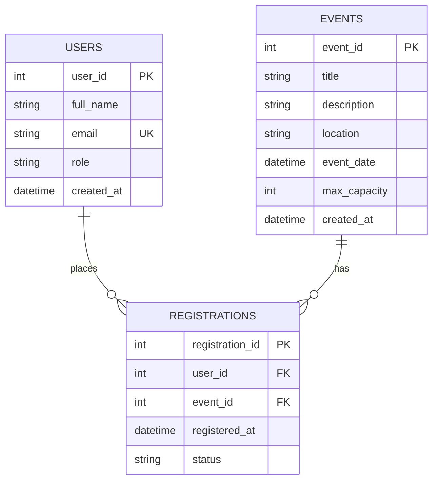

# Applied Generative AI for IT Solution Development - Group Hands-On Laboratory Examination

## Group Roster & Role Assignments
* **Rich Galicha** - Systems Architect & Prompt Lead (Task 1, Task 4 Unit Testing, Task 5)
* **Lance Congreso** - Frontend Engineer (Task 2)
* **Aldrich Amponin** - Database & Backend Engineer (Task 3, Task 4 Refactoring, Task 5)

---

## Task 1: Requirements Analysis & Prompt Architecture

### 1. Production-Grade RCTC Prompt
```text
[ROLE]
You are a Lead Systems Architect specializing in web application design, modern cloud architectures, and scalable full-stack software development.

[CONTEXT]
We are building a working prototype for an "Online Campus Event Management System" during a 3-hour team hackathon. The system allows students to browse upcoming campus events and register for them, while allowing administrators to view registered attendees. The solution needs to be clean, modular, maintainable, and quick to deploy.

[TASK]
Design an overall system architecture for this campus event platform. Provide:
1. High-level architecture components (Frontend, Backend/API, Database).
2. Key system data flows (Event Browsing, Registration, Admin Attendee Lookup).
3. Core technology stack recommendations tailored for fast prototype development.
4. Essential API endpoints needed to support core functionalities.

[CONSTRAINTS]
- Do NOT use third-party state management libraries like Redux or MobX.
- Do NOT include complex microservice patterns; stick to a simple monolithic or lightweight modular backend architecture.
- Do NOT recommend paid external SaaS services or non-standard protocols; use standard RESTful HTTP and relational databases.

### Architecture Overview
1. Frontend Layer: Semantic HTML5, CSS3, and JavaScript SPA/lightweight multi-page UI.
2. API / Application Layer: Node.js (Express.js) or C# ASP.NET Core Web API delivering standard REST endpoints.
3. Database Layer: Relational Database (PostgreSQL/SQL Server) for structured handling of Users, Events, and Registrations.

### Data Flow Summaries
- Event Browsing: Client sends GET request to `/api/events` -> Server fetches non-expired events from DB -> Rendered in Event Catalog.
- Student Registration: Client posts user credentials and event ID to `/api/registrations` -> Server verifies seat availability & domain -> Writes registration record to DB.
- Admin Attendee View: Authenticated admin sends GET request to `/api/events/{id}/attendees` -> Server fetches joined user list for the event.

### Core API Endpoints
- GET /api/events - Retrieve active events.
- POST /api/events - Create new event (Admin).
- POST /api/registrations - Register student for event.
- GET /api/events/{eventId}/registrations - List attendees for specific event.

## Task 3: Database Design & ERD Generation
### 1. Mermaid.js Entity-Relationship Diagram (ERD)

## Task 4: Shift-Left Testing, Security & Refactoring

### 1. Unit Testing (Email Domain & Seat Capacity Validation)
```csharp
using Xunit;
using Moq;
using System;

namespace EventSystem.Tests
{
    public interface IEventRepository
    {
        int GetRegisteredCount(int eventId);
        int GetEventCapacity(int eventId);
    }

    public class RegistrationValidator
    {
        private readonly IEventRepository _repo;

        public RegistrationValidator(IEventRepository repo)
        {
            _repo = repo;
        }

        public bool ValidateStudentEmail(string email)
        {
            if (string.IsNullOrWhiteSpace(email)) return false;
            return email.EndsWith("@univ.edu.ph", StringComparison.OrdinalIgnoreCase);
        }

        public bool CanRegister(int eventId)
        {
            int currentCount = _repo.GetRegisteredCount(eventId);
            int maxCapacity = _repo.GetEventCapacity(eventId);
            return currentCount < maxCapacity;
        }
    }

    public class RegistrationValidatorTests
    {
        [Theory]
        [InlineData("student@univ.edu.ph", true)]
        [InlineData("user@gmail.com", false)]
        [InlineData("", false)]
        public void ValidateStudentEmail_ShouldValidateCorrectDomain(string email, bool expected)
        {
            var validator = new RegistrationValidator(null);
            bool result = validator.ValidateStudentEmail(email);
            Assert.Equal(expected, result);
        }

        [Fact]
        public void CanRegister_ReturnsTrue_WhenSeatsAreAvailable()
        {
            var mockRepo = new Mock<IEventRepository>();
            mockRepo.Setup(r => r.GetRegisteredCount(1)).Returns(45);
            mockRepo.Setup(r => r.GetEventCapacity(1)).Returns(50);

            var validator = new RegistrationValidator(mockRepo.Object);
            bool result = validator.CanRegister(1);

            Assert.True(result);
        }

        [Fact]
        public void CanRegister_ReturnsFalse_WhenEventIsFull()
        {
            var mockRepo = new Mock<IEventRepository>();
            mockRepo.Setup(r => r.GetRegisteredCount(1)).Returns(50);
            mockRepo.Setup(r => r.GetEventCapacity(1)).Returns(50);

            var validator = new RegistrationValidator(mockRepo.Object);
            bool result = validator.CanRegister(1);

            Assert.False(result);
        }
    }
}
```
## Task 5: Group Integration & Verification Report

### 1. Setup Instructions
1. **Database Setup**:
   - Open `/database/schema.sql` in SQL Server Management Studio (SSMS) or PostgreSQL client.
   - Execute the DDL script to create `Users`, `Events`, and `Registrations` tables with foreign keys and indexes.
2. **Frontend UI**:
   - Open `/frontend/index.html` directly in any web browser to view the Event Catalog and accessible Registration Form.
3. **Backend Service**:
   - Ensure .NET 8 SDK is installed.
   - Compile `/backend/RegistrationService.cs` within your C# backend project solution.

### 2. AI Disclosure Statement
During this examination, our team utilized AI assistants (ChatGPT / Claude / v0) to assist in drafting initial architectural frameworks, HTML boilerplate UI components, database ERD representations, and C# unit tests. Every piece of AI-generated output was manually reviewed, compiled, and verified by team members against security standards, WCAG guidelines, and lab requirement constraints.

### 3. Group Verification Log Table

| Task # | Identified AI Flaw / Limitation | Manual Correction Applied | Member Responsible |
| :--- | :--- | :--- | :--- |
| **Task 2** | AI generated generic `<div>` containers and omitted `aria-label` attributes on form inputs. | Manually refactored the layout to semantic HTML5 (`<header>`, `<main>`, `<section>`) and added WCAG-compliant `aria-label` tags. | Lance Congreso |
| **Task 3** | AI failed to generate non-clustered performance indexes on foreign key columns in SQL schema. | Added `CREATE NONCLUSTERED INDEX` statements for `IX_Registrations_UserId` and `IX_Registrations_EventId`. | Aldrich Amponin |
| **Task 4** | AI generated database queries using raw string concatenation (SQL Injection risk) and failed to close `SqlConnection` instances. | Refactored code to use parameterized `SqlCommand` objects and wrapped connections inside C# `using` blocks for deterministic resource cleanup. | Aldrich Amponin & Rich Galicha |
